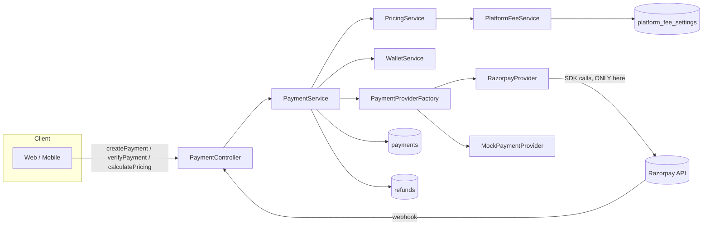

# Payment Architecture

## Why this exists

Before this, TuckZone had exactly one payment concept: wallet top-up, via a mock gateway.
Orders were paid only by debiting wallet balance — there was no platform fee, no gateway
checkout for orders, and no way to add a second payment provider without rewriting the
wallet code. This document describes what replaced that.

## Goals

- **Provider-independent.** Swapping Razorpay for another gateway is one new class and one
  enum value — no other file changes.
- **Pricing separate from payments.** `PaymentService` never computes a fee; `PricingService`
  does. Neither imports a provider SDK.
- **Backward-compatible.** Every existing endpoint (`/api/wallet/*`) keeps its exact
  contract. Platform fee starts disabled, so nothing about existing money math changes
  until an admin turns it on.

## Components

### `payment/` — the provider abstraction

- `PaymentProvider` — the Strategy interface every gateway implements: `createOrder`,
  `verifyPayment`, `refund`, `verifyWebhookSignature`.
- `PaymentProviderFactory` — the Factory. Spring hands it every registered
  `PaymentProvider` bean; it resolves which one is active from
  `app.payment.provider`. `PaymentService` never instantiates a provider itself.
- `payment/providers/MockPaymentProvider` — in-process, deterministic, used in dev/test.
- `payment/providers/RazorpayProvider` — the **only** file in the codebase that imports
  `com.razorpay:razorpay-java`. Order creation and refunds go through the SDK; signature
  verification does not (see below).
- `HmacSignatureVerifier` — shared HMAC-SHA256 primitive. Razorpay's checkout signature
  (`order_id|payment_id`) and webhook signature (raw body) are both plain HMAC-SHA256,
  confirmed directly from the SDK's own `Utils.java` source — so this is implemented once,
  here, and both `MockPaymentProvider` and `RazorpayProvider` use it, rather than each
  provider re-implementing (or the real one calling into the SDK for something this simple).

### `pricing/` — the pricing engine

- `PricingService` — `calculateWalletRechargePricing` and `calculateCheckoutPricing`.
  Returns a `PricingBreakdown` (subtotal, platformFee, discount, tax, walletUsed,
  gatewayAmount, grandTotal, currency).
- `PlatformFeeService` — the only place fee arithmetic happens. Reads
  `PlatformFeeSettings` (percentage-or-fixed, min/max clamps, enabled flag) from the
  database — nothing is hardcoded.

**Where the platform fee lands**: for `WALLET_RECHARGE`, the fee is always paid through the
gateway (`gatewayAmount = amount + fee`), and the wallet is credited `amount` only — it
never receives the fee. For `CHECKOUT`, the fee rides on the gateway leg whenever one
exists (`WALLET_PLUS_GATEWAY`); the one exception is `WALLET_ONLY`, where there is no
gateway leg at all, so wallet necessarily funds everything including the fee.

### `service/PaymentService` — the orchestrator

`createPayment`, `verifyPayment`, `refundPayment`, `getPaymentStatus`, `calculatePricing`,
`handleWebhook`, `mockComplete`. Composes `PricingService` + `PaymentProviderFactory` +
`PaymentRepository`; never imports a provider SDK, never computes a fee.

`WalletServiceImpl` and `OrderServiceImpl` both call into this rather than talking to a
provider directly — wallet recharge and order checkout are both just a
`CreatePaymentCommand` with a different `PaymentUseCase`.

### Idempotency and security

- `payments.provider_order_id` is unique, and settlement is a one-way `PENDING → PAID`
  transition taken under a `PESSIMISTIC_WRITE` row lock (`PaymentRepository.
  lockByProviderOrderId`) — the same mechanism the original wallet-only code used for
  top-ups, generalised to every use case. A retried client `verify` call and a webhook
  arriving for the same payment both resolve to the same idempotent outcome.
- The amount charged is always read from the stored `Payment` row, never from the
  client's verify payload or the webhook body — those only ever supply the provider's
  payment id and signature.
- `RateLimiterService` throttles `createPayment`/`verifyPayment` per user, same pattern as
  the OTP endpoints.
- An optional client idempotency key on `createPayment` prevents a double-tap from
  creating two payment intents (`payments` has a partial unique index on
  `(user_id, idempotency_key) where idempotency_key is not null`).

### Two safety mechanisms worth calling out

1. **`PaymentExpirySweeper`** (`payment/PaymentExpirySweeper.java`) — a `@Scheduled` job,
   same style as `OtpServiceImpl.purgeExpiredCodes`/`OutboxSweeper`. A `WALLET_PLUS_GATEWAY`
   checkout eagerly debits the wallet portion *before* the gateway leg is attempted (no
   reason to make the customer wait on a network call for money already available). If the
   customer never completes the gateway leg, this job — every 2 minutes, for payments
   `PENDING` more than 15 minutes — reverses that debit, fails the payment, restores stock,
   and cancels the order.
2. **Refunds are split proportionally**, never 100% to wallet by default. `PaymentService.
   refundPayment` computes `walletShare`/`gatewayShare` from how the original payment was
   funded, excluding the platform fee from both (the fee is never refunded — it's revenue).

## What was deliberately not built

Coupons, gift cards, EMI, BNPL, subscription billing, split settlement, and providers
beyond Razorpay were scoped out of this pass — building untested code against SDKs/business
rules with no way to verify them would be worse than not having them. `PaymentUseCase.
SUBSCRIPTION` and `PaymentProviderType` are structured so adding them later doesn't require
touching this architecture — see `ADDING_A_NEW_PROVIDER.md`.
