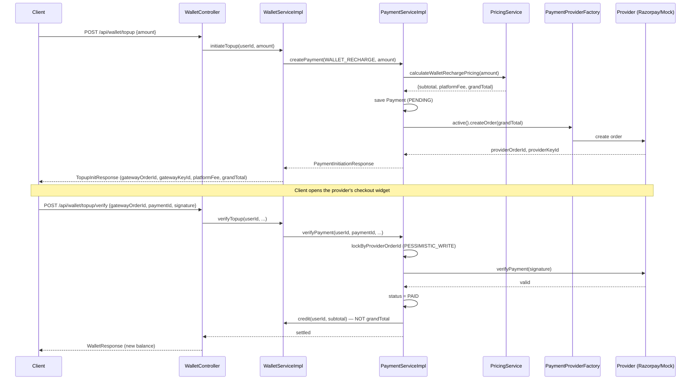
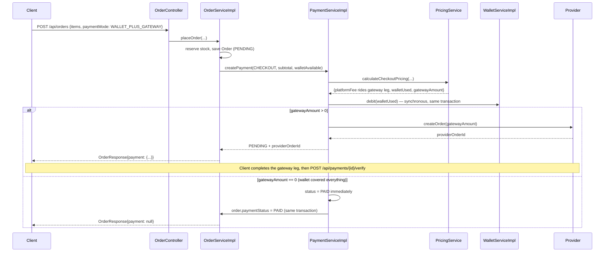
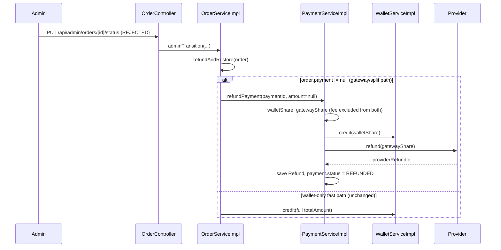
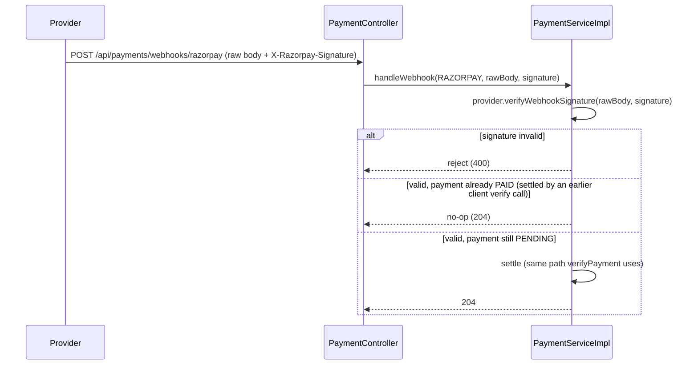

# Sequence Diagrams

## Wallet recharge (gateway-funded)

```mermaid
sequenceDiagram
    participant C as Client
    participant WC as WalletController
    participant WS as WalletServiceImpl
    participant PS as PaymentServiceImpl
    participant Pr as PricingService
    participant PF as PaymentProviderFactory
    participant GW as Provider (Razorpay/Mock)

    C->>WC: POST /api/wallet/topup {amount}
    WC->>WS: initiateTopup(userId, amount)
    WS->>PS: createPayment(WALLET_RECHARGE, amount)
    PS->>Pr: calculateWalletRechargePricing(amount)
    Pr-->>PS: {subtotal, platformFee, grandTotal}
    PS->>PS: save Payment (PENDING)
    PS->>PF: active().createOrder(grandTotal)
    PF->>GW: create order
    GW-->>PS: providerOrderId, providerKeyId
    PS-->>WS: PaymentInitiationResponse
    WS-->>C: TopupInitResponse (gatewayOrderId, gatewayKeyId, platformFee, grandTotal)

    Note over C,GW: Client opens the provider's checkout widget

    C->>WC: POST /api/wallet/topup/verify {gatewayOrderId, paymentId, signature}
    WC->>WS: verifyTopup(userId, ...)
    WS->>PS: verifyPayment(userId, paymentId, ...)
    PS->>PS: lockByProviderOrderId (PESSIMISTIC_WRITE)
    PS->>GW: verifyPayment(signature)
    GW-->>PS: valid
    PS->>PS: status = PAID
    PS->>WS: credit(userId, subtotal) — NOT grandTotal
    PS-->>WC: settled
    WC-->>C: WalletResponse (new balance)
```

## Order checkout (wallet + gateway split)

```mermaid
sequenceDiagram
    participant C as Client
    participant OC as OrderController
    participant OS as OrderServiceImpl
    participant PS as PaymentServiceImpl
    participant Pr as PricingService
    participant W as WalletServiceImpl
    participant GW as Provider

    C->>OC: POST /api/orders {items, paymentMode: WALLET_PLUS_GATEWAY}
    OC->>OS: placeOrder(...)
    OS->>OS: reserve stock, save Order (PENDING)
    OS->>PS: createPayment(CHECKOUT, subtotal, walletAvailable)
    PS->>Pr: calculateCheckoutPricing(...)
    Pr-->>PS: {platformFee rides gateway leg, walletUsed, gatewayAmount}
    PS->>W: debit(walletUsed) — synchronous, same transaction
    alt gatewayAmount > 0
        PS->>GW: createOrder(gatewayAmount)
        GW-->>PS: providerOrderId
        PS-->>OS: PENDING + providerOrderId
        OS-->>C: OrderResponse{payment: {...}}
        Note over C,GW: Client completes the gateway leg, then POST /api/payments/{id}/verify
    else gatewayAmount == 0 (wallet covered everything)
        PS->>PS: status = PAID immediately
        PS->>OS: order.paymentStatus = PAID (same transaction)
        OS-->>C: OrderResponse{payment: null}
    end
```

## Refund (proportional split)

```mermaid
sequenceDiagram
    participant Admin
    participant OC as OrderController
    participant OS as OrderServiceImpl
    participant PS as PaymentServiceImpl
    participant W as WalletServiceImpl
    participant GW as Provider

    Admin->>OC: PUT /api/admin/orders/{id}/status {REJECTED}
    OC->>OS: adminTransition(...)
    OS->>OS: refundAndRestore(order)
    alt order.payment != null (gateway/split path)
        OS->>PS: refundPayment(paymentId, amount=null)
        PS->>PS: walletShare, gatewayShare (fee excluded from both)
        PS->>W: credit(walletShare)
        PS->>GW: refund(gatewayShare)
        GW-->>PS: providerRefundId
        PS->>PS: save Refund, payment.status = REFUNDED
    else wallet-only fast path (unchanged)
        OS->>W: credit(full totalAmount)
    end
```

## Webhook reconciliation

```mermaid
sequenceDiagram
    participant GW as Provider
    participant PC as PaymentController
    participant PS as PaymentServiceImpl

    GW->>PC: POST /api/payments/webhooks/razorpay (raw body + X-Razorpay-Signature)
    PC->>PS: handleWebhook(RAZORPAY, rawBody, signature)
    PS->>PS: provider.verifyWebhookSignature(rawBody, signature)
    alt signature invalid
        PS-->>PC: reject (400)
    else valid, payment already PAID (settled by an earlier client verify call)
        PS-->>PC: no-op (204)
    else valid, payment still PENDING
        PS->>PS: settle (same path verifyPayment uses)
        PS-->>PC: 204
    end
```
